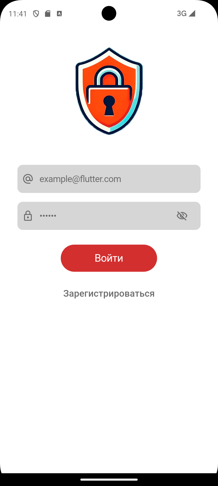
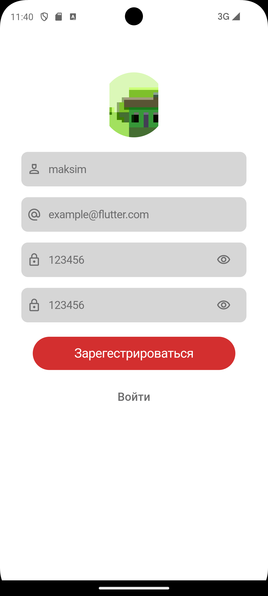
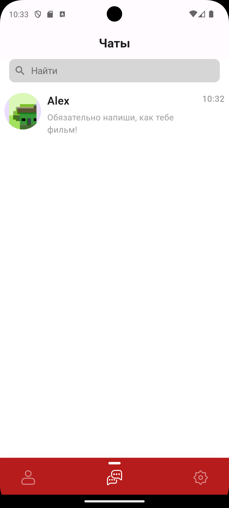
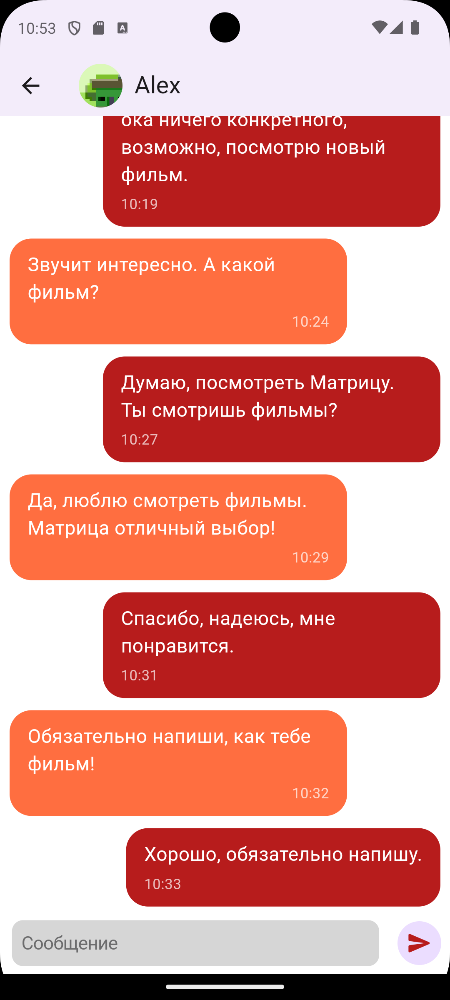
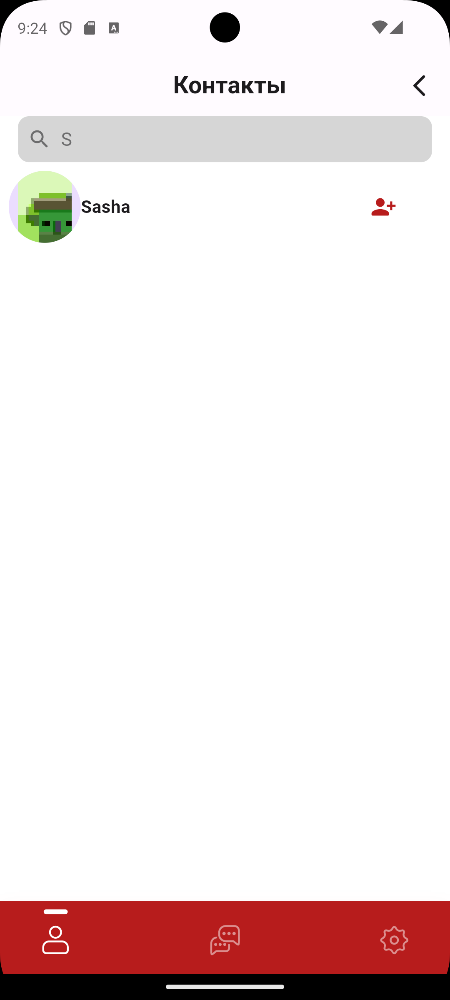
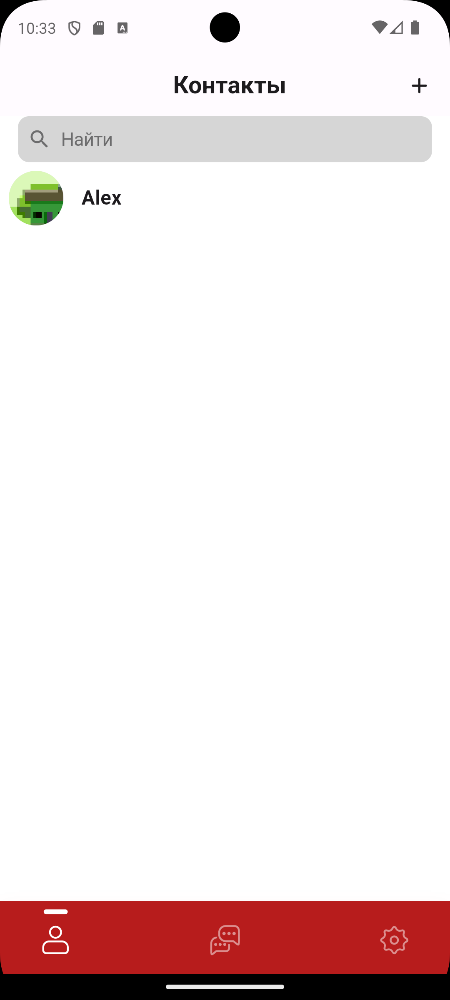
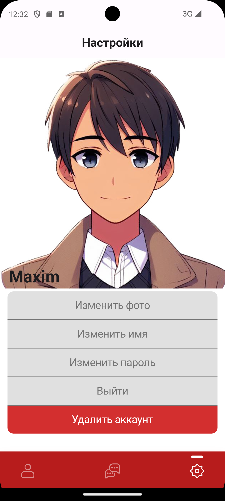

# Secure Link Messenger

Secure Link Messenger is a highly secure messaging application built with Flutter. It uses asymmetric encryption to ensure that messages are encrypted end-to-end, providing a high level of security and privacy for its users. This README will guide you through the features, installation process, and the technology stack used in the project.

## Features

- **End-to-End Encryption**: Messages are encrypted on the sender's device and decrypted on the receiver's device, ensuring that only the intended recipient can read the messages.
- **Asymmetric Encryption**: Uses a pair of public and private keys to encrypt and decrypt messages.
- **User Authentication**: Users can register and log in using their email and password.
- **Real-Time Messaging**: Supports real-time messaging using Firebase Firestore.
- **Secure Storage**: User data and encryption keys are securely stored on the device.
- **Cross-Platform**: Available on both Android and iOS.

## Screenshots


*Signin Screen*


*Signup Screen*


*Chat List*


*Chat Screen*


*Add To Contact*


*My Contacts*


*User Screen*

## Technology Stack

- **Flutter**: The framework used to build the mobile application.
- **Firebase**: Backend-as-a-Service (BaaS) used for authentication, real-time database, and cloud storage.
- **Asymmetric Encryption**: Uses RSA for public-key cryptography.
- **Flutter Bloc**: State management library used for managing state across the application.

## Installation

### Prerequisites

- Flutter SDK: [Install Flutter](https://flutter.dev/docs/get-started/install)
- Firebase Project: [Create a Firebase project](https://firebase.google.com/)

### Steps

1. **Clone the repository**:

   ```sh
   git clone https://github.com/yourusername/secure-link-messenger.git
2. **Set up Firebase**:

    Go to the Firebase Console and create a new project.
    Add an Android and/or iOS app to your project.
    Download the google-services.json file for Android and place it in the android/app directory.
    Download the GoogleService-Info.plist file for iOS and place it in the ios/Runner directory.
    Enable Firebase Authentication and Firestore in your Firebase project.

3. **Install dependencies**:
   ```sh
   flutter pub get
4. **Run the app**:
   ```sh
   flutter run
## Usage
### Register and Login
- Users can register by providing an email and password.
- Upon successful registration, a pair of public and private keys is generated and stored securely.
- Users can log in using their registered email and password.
### Sending and Receiving Messages
- Users can send messages to other registered users.
- Each message is encrypted using the recipient's public key.
- The recipient can decrypt the message using their private key.
### Viewing Chats
   - Users can view their chat list which displays the most recent message for each chat.
   - Clicking on a chat opens the conversation where users can send and receive messages in real-time.

### Security
- Public and Private Keys: Each user has a unique pair of public and private keys. The public key is used to encrypt messages, and the private key is used to decrypt messages.
- Secure Storage: Private keys are stored securely on the user's device using secure storage mechanisms provided by the platform.
- Firebase Authentication: Ensures that only authenticated users can access the application.

